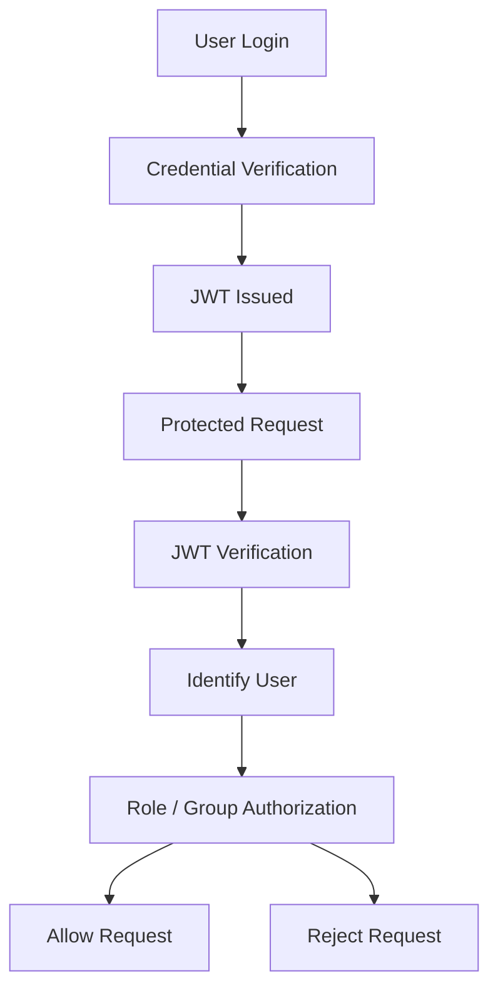
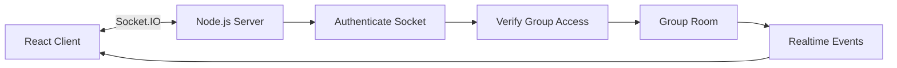
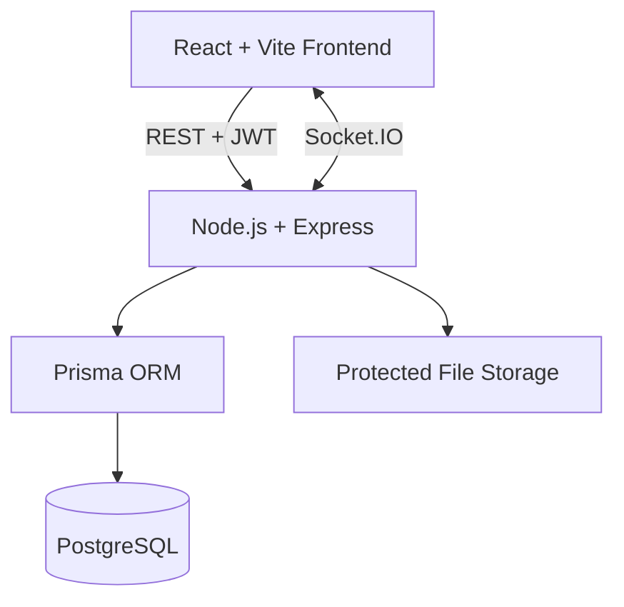
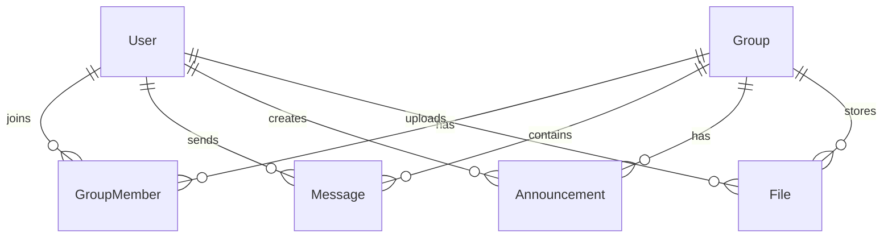
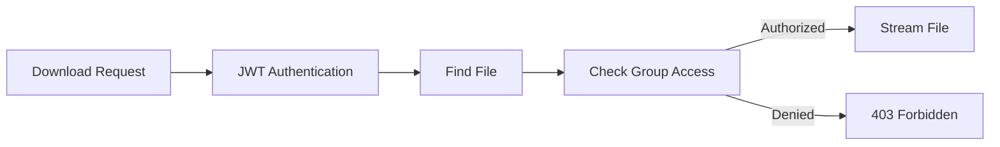

# CampusConnect

**A full-stack college communication and academic collaboration platform.**

CampusConnect brings group chat, announcements, file sharing, and attendance into one web application scoped by class groups (branch and year). It was built to practice end-to-end engineering: authenticated APIs, role-aware authorization, realtime updates, relational data modeling, and secure file handling—not as an official college system.

React • Node.js • Express • PostgreSQL • Prisma • Socket.IO • Docker

---

## Overview

Students and staff collaborate inside **groups** (for example `IT-SY` for IT second year). The backend verifies every sensitive action: REST controllers, protected downloads, and Socket.IO handlers all enforce authentication and group access.

This repository is a **college-oriented prototype and portfolio project**. It demonstrates full-stack integration, security patterns, realtime communication, and database design. It is not production-hardened and is not deployed as an institutional platform.

> The Prisma schema defines `PrivateMessage` and `LeaveRequest`, but there are **no routes, controllers, or UI** for those models—they are not part of the shipped feature set.

---

## Key Features

### 🔐 Authentication & Security

- Roll-number login with **bcrypt** password hashing and **JWT** (7-day expiry; claims include user id, role, roll number)
- **Protected REST APIs** via `Authorization: Bearer` middleware
- **Authenticated Socket.IO** (`handshake.auth.token` verified before connection)
- **Password change** with current-password verification
- Public **`POST /api/auth/register`** for **STUDENT** accounts only (optional auto-join to matching branch/year group; the UI currently exposes login only)
- **Secure file downloads** through `GET /uploads/:filename`—not public static hosting

### 💬 Realtime Communication

- **Group chat** over Socket.IO on the same Node HTTP server as Express
- **Group rooms** after server-side `joinGroup` access checks
- **Persisted messages** (Prisma) with REST history load and **`receiveMessage`** broadcast
- **Sender identity from JWT**, not client-supplied ids
- **Message deletion** via REST with permissions; **`message_deleted`** keeps clients in sync
- **Typing indicators** and **online presence** (in-memory on the server process)
- **File attachments** in chat when uploads create linked `File` + attachment `Message` records

### 📢 Announcements

- Group-scoped create, list, and delete
- Staff (**TEACHER** / **ADMIN**) can create in accessible groups
- Delete: admins in accessible groups; teachers may delete their own
- Realtime **`announcement_created`** / **`announcement_deleted`**

### 📁 File Management

- Multipart upload (validated MIME types, 10 MB limit) with **Multer** disk storage
- Group listing and role-based deletion
- Chat attachment flow with transactional create and realtime events
- **Authenticated blob download** with group authorization

### 📊 Attendance

- Per-student **attendance percentage** on the `User` model
- Students view their own value; staff view member percentages on group member endpoints
- Staff updates with shared-group rules for non-admin teachers
- **Bulk CSV/XLSX import** with branch/year group matching and transactional user creation

### 👥 Role-Based Access

- Roles: **STUDENT**, **TEACHER**, **ADMIN** (Prisma enum)
- Permission helpers also recognize **FACULTY** for staff checks, but it is not a storable enum value—teaching staff use **TEACHER**
- Enforcement lives in controllers and socket handlers, not only in the UI

---

## 🔐 Security & Authorization

**Authentication** — *Who are you?*  
Login verifies credentials; the server issues a JWT used on REST and Socket.IO.

**Authorization** — *What may you do?*  
After identity is known, controllers check role rules, ownership, and group membership (admins bypass membership where implemented).



CampusConnect does **not** rely on hiding buttons alone. Shared helpers in `backend/src/utils/permissions.js` and `getUserGroupAccess()` gate group-scoped data; socket handlers re-check access on `joinGroup` and `sendMessage`.

| Mechanism | Role in this project |
| --- | --- |
| **JWT** | Stateless identity on REST headers and socket handshake |
| **RBAC** | STUDENT / TEACHER / ADMIN capabilities for announcements, files, attendance, import |
| **Group authorization** | `GroupMember` membership; admins may access any group via `canAccessGroup` |
| **Authenticated Socket.IO** | Connection rejected without valid token |
| **Secure files** | Metadata in PostgreSQL; bytes streamed only after JWT + group check |

---

## ⚡ Realtime Communication



- Clients connect with the same JWT as REST; **`registerUser`** tracks online user ids (process-local)
- **`joinGroup`** runs `getUserGroupAccess` before `socket.join(String(groupId))`
- Chat **`sendMessage`** persists then emits **`receiveMessage`** to the room
- Announcements and files: **REST persists first**; controllers emit group events (`announcement_*`, `file_*`, `message_deleted`)
- Typing and presence are ephemeral—not stored in PostgreSQL

**Authoritative state:** REST + database. **Live delivery:** Socket.IO fan-out to connected group members.

---

## 🏗️ Architecture



| Layer | Responsibility |
| --- | --- |
| **Frontend** | React/Vite UI, Axios API client, Socket.IO client, auth context, panel-based workspace (`ChatPage`) |
| **Backend** | Express REST routes, JWT middleware, controllers, permission/group helpers, Socket.IO on shared HTTP server |
| **Database** | PostgreSQL via Prisma migrations and client |
| **Storage** | Uploads under `backend/uploads`; served only through authenticated download handler |

---

## Tech Stack

| Layer | Technology | Purpose |
| --- | --- | --- |
| Frontend | React + Vite | User interface |
| Backend | Node.js + Express | REST API and application logic |
| Database | PostgreSQL | Persistent relational data |
| ORM | Prisma | Schema, migrations, data access |
| Realtime | Socket.IO | Live chat, presence, sync events |
| Authentication | JWT + bcrypt | Login and password security |
| File uploads | Multer | Multipart handling to disk |
| Import | SheetJS (`xlsx`) | CSV/XLSX student import |
| Infrastructure | Docker Compose | Local PostgreSQL container |
| Version control | Git / GitHub | Source control |

---

## Role & Permission Matrix

Students access **groups they belong to**. Teachers operate in groups they can access (typically as members). **Admins** have broader backend access—including any group via `canAccessGroup`—but use the **same ChatPage UI** as other roles (no separate admin dashboard; some actions such as group creation are API-only).

| Capability | STUDENT | TEACHER | ADMIN |
| --- | :---: | :---: | :---: |
| Login / change password | ✓ | ✓ | ✓ |
| Group chat & download files | Member groups | Accessible groups | Any group |
| Create announcement | — | ✓ | ✓ |
| Delete announcement | — | Own only | ✓ (accessible group) |
| Upload file | ✓ | ✓ | ✓ |
| Delete file | — | Own upload | ✓ |
| Delete message | Own | Own + group messages | ✓ |
| View own attendance | ✓ | ✓ | ✓ |
| View / update member attendance | — | Shared-group students | Any student |
| Import students (CSV/XLSX) | — | ✓ | ✓ |
| Create group (API) | — | — | ✓ |

---

## 🗄️ Data Model

Core entities and relationships:



| Model | Purpose |
| --- | --- |
| **User** | Account, role, branch/year, attendance percentage |
| **Group** | Branch, year, display name (class scope) |
| **GroupMember** | Many-to-many user ↔ group |
| **Message** | Group chat text; optional attachment URL/name |
| **Announcement** | Group notices with creator |
| **File** | Upload metadata linked to group and uploader |

**Schema only (not shipped):** `PrivateMessage`, `LeaveRequest`.

---

## 📁 Secure File Access



Uploads are written to disk but **not** exposed as anonymous static assets. The UI requests a blob with the Bearer token; the server looks up file metadata, validates group access, then streams the file with the original filename.

---

## Attendance & Bulk Import

- **Model:** single `attendancePercentage` field per student (0–100), not a daily session log
- **Import:** staff upload CSV or XLSX (`name`, `rollNo`, `branch`, `year`); rows match existing branch/year **Group** records
- **Safety:** duplicate roll numbers skipped; per-row errors returned; successful rows create **STUDENT** users and **GroupMember** links in transactions
- **Demo file:** root **`students.csv`** contains **fictional** sample rows for import demos

---

## API & Socket.IO Overview

### REST (summary)

| Area | Endpoints (authenticated unless noted) |
| --- | --- |
| Auth | `POST /api/auth/login`, `POST /api/auth/register`, `PATCH /api/auth/change-password` |
| Groups | `GET/POST /api/groups`, `GET /api/groups/my-groups`, `GET .../members`, `POST /api/groups/join` |
| Messages | `GET /api/messages/:groupId`, `DELETE /api/messages/:id` (send via socket) |
| Announcements | `POST /api/announcements`, `GET /api/announcements/:groupId`, `DELETE /api/announcements/:id` |
| Files | `POST /api/files/upload`, `GET /api/files/:groupId`, `DELETE /api/files/:id`, `GET /uploads/:filename` |
| Attendance | `GET /api/attendance/me`, `PATCH /api/attendance/:userId` |
| Admin | `POST /api/admin/import-students` |

Full reference: [docs/API_AND_REALTIME.md](docs/API_AND_REALTIME.md).

### Socket.IO (summary)

| Event | Direction | Purpose |
| --- | --- | --- |
| `registerUser` | C → S | Register presence |
| `onlineUsers` | S → clients | Broadcast online user ids |
| `joinGroup` | C → S | Join authorized group room |
| `sendMessage` / `receiveMessage` | C ↔ S | Persist and deliver chat |
| `typing` / `stopTyping` | C → S | Typing relay |
| `userTyping` / `userStopTyping` | S → room | Typing UI |
| `announcement_created` / `announcement_deleted` | S → room | Announcement sync |
| `file_created` / `file_deleted` | S → room | File list sync |
| `message_deleted` | S → room | Message removal sync |

---

## Project Structure

```text
campus-connect/
├── backend/
│   ├── prisma/          # schema, migrations, seedGroups
│   ├── src/
│   │   ├── controllers/
│   │   ├── routes/
│   │   ├── middleware/
│   │   ├── sockets/
│   │   └── utils/
│   └── uploads/         # disk storage (protected download)
├── frontend/
│   └── src/
│       ├── pages/       # LoginPage, ChatPage
│       ├── components/
│       ├── services/
│       └── sockets/
├── docs/
├── docker/
│   └── docker-compose.yml   # PostgreSQL only
├── students.csv             # fictional import demo
├── package.json
└── README.md
```

---

## Run Locally

### Prerequisites

- Node.js (LTS recommended)
- npm
- PostgreSQL (local install or Docker)

### 1. Clone

```bash
git clone <your-repo-url>
cd campus-connect
```

### 2. Database (Docker option)

```bash
cd docker
docker compose up -d
```

Default compose settings create database `campusconnect` on port `5432`. Use your own credentials in environment variables—do not commit secrets.

### 3. Backend

```bash
cd backend
npm install
```

Create a `.env` in `backend/` with at least:

- `JWT_SECRET` — required (server fails to start without it)
- `DATABASE_URL` — PostgreSQL connection string for Prisma
- Optional: `PORT` (default `5000`), `CORS_ORIGIN`, `DB_*` for the raw `pg` pool

Apply migrations and optional group seed:

```bash
npx prisma migrate deploy
npm run seed:groups
```

Start the API and Socket.IO server:

```bash
npm start
```

### 4. Frontend

```bash
cd frontend
npm install
```

Optional `.env`:

- `VITE_API_URL` — default `http://localhost:5000/api`
- `VITE_SOCKET_URL` — default `http://localhost:5000`

```bash
npm run dev
```

Open the Vite dev URL and sign in with an existing account (create students via import or `POST /api/auth/register`).

---

## Demo Data

**`students.csv`** at the repository root is **fictional demo data** for bulk import. It illustrates the required columns and branch/year matching; it does not contain real student records.

---

## Documentation

- [Project Overview](docs/PROJECT_OVERVIEW.md)
- [Architecture](docs/ARCHITECTURE.md)
- [Features & Permissions](docs/FEATURES_AND_PERMISSIONS.md)
- [API & Realtime](docs/API_AND_REALTIME.md)
- [Demo & Learning Guide](docs/DEMO_AND_LEARNING_GUIDE.md)
- [Database](docs/DATABASE.md) · [Socket Events](docs/SOCKET_EVENTS.md) · [Security Checklist](docs/SECURITY_CHECKLIST.md)

---

## What I Learned

Building CampusConnect covered practical full-stack work: designing REST resources, implementing JWT auth and bcrypt hashing, centralizing RBAC and group-scoped authorization, wiring Socket.IO with authenticated rooms and REST-backed persistence, modeling relational data in PostgreSQL with Prisma, handling secure multipart uploads and authorized downloads, synchronizing client state with realtime events, running PostgreSQL via Docker Compose, and iterating through integration debugging across React, Express, and the database.

---

## Future Roadmap

Planned improvements—not current features:

- Production cloud deployment with HTTPS and security hardening
- CI/CD, automated tests, and load testing
- Centralized logging and monitoring
- Horizontally scaled Socket.IO (e.g. Redis adapter)
- Object storage instead of local disk uploads
- Database backups and operational runbooks
- Richer branch/year/division modeling
- Private teacher–student messaging (schema stub exists; feature not built)

---

## Project Status

> **Demo-ready functional project**

Core flows—login, group workspace, chat, announcements, files, attendance, and import—are implemented and have been exercised in demo scenarios. This remains a **portfolio prototype**, not a production deployment. Shipping to production would need additional infrastructure, hardening, monitoring, backups, scaling, and load validation.

---

## 👨‍💻 Author

**Pratik Koli**

Full-stack engineering project with a longer-term focus on DevOps, infrastructure, security, and platform engineering.
